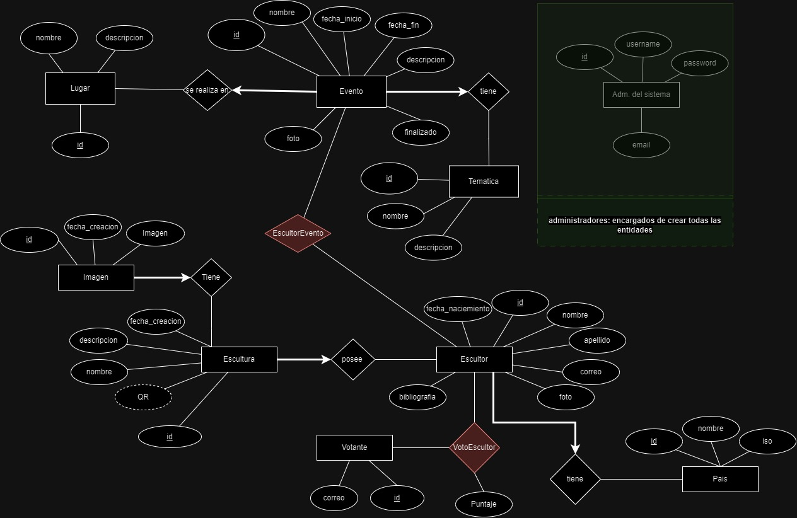

<h1 align=center><code>Trabajo Practico Final - Desarrollo de Software</code></h1>

    

 

Grupo N°2:

- Acosta Quintana, Lautaro.
- Saucedo, Gonzalo Nicolás.
- Stegmayer, Tobías Sebastián.
- Vallejos, Enzo Nahuel.
- Niveyro, Ivan.

Profesores:
- Jorge Eduardo Villaverde.
- Jose A. Fernández.

Cátedra: Desarrollo de Software.

Ciclo 2024 - 2do cuatrimestre

# Tabla de Contenidos

1.  [TRABAJO PRÁCTICO INTEGRADOR](#org4320643)
    1.  [Introducción](#orge4a460e)
        1.  [Stack](#orgfcd75ae)
    2.  [Metodologías Ágiles Utilizadas](#orgc5079d5)
        1.  [Descripción:](#org6bd5ada)
    3.  [Modelado de Datos](#org45b2e33)
    4.  [Documentación de la API:](#orgcb5f8c4)
        1.  [Descripción](#org28488e8)
    5.  [Requerimientos funcionales](#org9d85c19)
    6.  [Requerimientos no funcionales](#org59e0137)

## Introducción

La arquitectura que decidimos implementar fue una de microservicios, por lo que tendremos una API REST que provea toda la información sobre el evento de la bienal para que sea consumida por una landing page y un backoffice para los empleados del evento.

Para organizar este trabajo, en el grupo nos dividimos las tareas de acuerdo a nuestra experiencia, construyendo ambos componentes y así poder avanzar de manera conjunta.

### Stack

1.  REST API

    Consideramos en un principio desarrollarlo usando Go, porque vimos que nos ofrecía las siguientes ventajas:
    
    -   Buena performance, aun siendo un lenguaje con recolector de basura.
    -   Gran librería standard con todo lo necesario para desarrollar un servicio web, incluso con soporte nativo para la concurrencia.
    -   Curva de aprendiza baja para empezar a ser productivos.
    -   Compila a un binario estático, por lo que la distribución de la aplicación es más sencilla que en lenguajes interpretados.
    
    Por otro lado, los puntos negativos son:
    
    -   No existe una manera estandarizada para construir servidores web como puede encontrarse en frameworks como Django.
    -   No todos los miembros del equipo tenían experiencia en el lenguaje.
    -   Restricciones de tiempo.
    
    Estos puntos nos hicieron recapacitar y terminamos adoptando Django para continuar con el desarrollo por los siguientes motivos:
    
    -   Todos los miembros del equipo teníamos experiencia con el framework y esto nos permitía agilizar el desarrollo.
    -   El framework incluye muchas utilidades ya implementadas y testeadas por la comunidad, como pueden ser el sistema de autenticación de usuarios, manejo de correos, conexión a bases de datos, entre otras cosas.
    
    Estos puntos fueron suficiente motivo para dejar de lado los beneficios en performance y distribución que hubiéramos tenido usando Go.

2.  Landing Page

    Permite a los visitantes explorar los eventos de la bienal, ver detalles sobre los escultores y más importante, permite votar a los escultores durante la competencia.
    
    Decidimos que queríamos optimizar la performance y la experiencia de usuario, para eso buscamos aprovechar al máximo servir contenido estático y utilizar la menor cantidad posible de JavaScript en el cliente, para así reducir la latencia que experimenta el usuario al navegar por nuestro sitio.
    
    Para lograr esto utilizamos además el meta-framework Astro porque se alineaba directamente con nuestras intenciones y adoptarlo era sumamente fácil porque se concentra en escribir HTML y CSS, dejando en nuestras manos dónde añadir interactividad o responsivenes, permitiéndonos utilizar TypeScript de manera transparente.

3.  Backoffice

    Exclusivo para los empleados/administradores de la Bienal, esta sección permite gestionar eventos, escultores y demás datos del sistema.
    
    Debido a que tenemos que mostrar contenido dinámico que cambia a lo largo del tiempo numerosas veces, generalmente en formato tabular, optamos por implementarlo en TypeScript utilizando React, aprovechando que miembros del equipo ya tenían experiencia acumulada usando la librería.

4.  PostgreSQL

    Para la base de datos decidimos utilizar [PostgreSQL](https://www.postgresql.org/) por su popularidad y robustez, teniendo en cuenta que es una elección común en aplicaciones similares y que sus capacidades alcanzan y sobra para nuestros objetivos.
    
    En producción, utilizamos [Azure Database for PostgreSQL Flexible Server](https://azure.microsoft.com/en-us/products/postgresql), un servicio de base de datos administrado ofrecido por Microsoft Azure.

5.  Redis

    Utilizamos esta base de datos key-value como cache de nuestro servicio web, para así evitar innecesarios viajes a la base de datos, los cuales resultan tener una gran latencia y empeoran la experiencia del usuario.

6.  Docker

    Durante el desarrollo utilizamos [Docker](https://www.docker.com/) para utilizar instancias de PostgreSQL y Redis. De esta manera aseguramos determinismo en las versiones que utilizamos cada miembro del equipo en sus máquinas locales.
    
    También lo utilizamos para crear un contenedor de nuestro servicio web de acuerdo al manifiesto declarado por un Dockerfile y utilizarlo para facilitar la distribución de nuestro servicio web, ya que al ser un lenguaje interpretado, resultaba necesario para evitar problemas.

7.  Git

    El sistema de versionado manejado por todos en el equipo.

8.  GitHub Actions

    Aprovechamos prácticas DevOps como la integración continua para poder iterar rápidamente sobre nuestro código, controlando en cada momento que la aplicación pase la suite de testeos que diseñamos y asegurar su calidad. Para eso utilizamos [GitHub Actions](https://docs.github.com/en/actions) por su fácil integración con un repositorio en GitHub.

9.  Azure App Service

    Aprovechando que podemos utilizar nuestra cuenta institucional de la facultad para recibir un crédito gratis, utilizamos el [App Service](https://learn.microsoft.com/en-us/azure/app-service/overview) de Azure para desplegar nuestro servicio web, subiendo nuestro contenedor y utilizando [Docker Compose](https://docs.docker.com/compose/) para ejecutarlo junto a Redis.

10. Netlify

    Hosteamos tanto la landing page como el backoffice en [Netlify](https://www.netlify.com/), aprovechando su plan gratis y su excelente integración con GitHub para poder realizar despliegues automáticos de nuestra aplicación a medida que avanzábamos en el desarrollo.

11. Cloudflare

    Adquirimos el dominio en [Cloudflare](https://www.cloudflare.com/) usando y lo utilizamos para gestionar las configuraciones de DNS de ambos servicios alojados en Netlify. De esta manera, podemos aprovechar la CDN de   Cloudflare, configurar políticas de cache, optimizar el rendimiento del sitio web y configurar la seguridad de nuestro sitio web, permitiendo solamente accesos HTTPS, entra otras configuraciones.

## Metodologías Ágiles Utilizadas

### Descripción

Para gestionar el proyecto, adoptamos la metodología ágil Kanban utilizando un tablero de la aplicación [Trello](https://trello.com/). Este enfoque permitió al equipo organizar, priorizar y controlar el progreso de las tareas de manera eficiente.

1.  Estructura del Tablero:

    El tablero utilizado está dividido en tres carriles principales:
    
    1.  Pendiente: Contenía las tareas que aún no se habían comenzado.
    2.  En Progreso: Incluía las tareas en desarrollo, proporcionando visibilidad sobre el trabajo activo.
    3.  Completado: Almacenaba las tareas finalizadas, sirviendo como referencia del progreso alcanzado.
    
    Además, el tablero estaba organizado en dos pestañas separadas:
    
    -   Frontend: Tareas específicas relacionadas con el desarrollo de la interfaz de usuario.
    -   Backend: Tareas relacionadas con la lógica del servidor, APIs y gestión de datos.

## Modelado de Datos

1.  Descripción

    El modelado de datos se inició con la creación de un diagrama entidad-relación (DER), que permitió definir visualmente las relaciones entre las entidades principales del sistema. Este modelo sirvió como base para estructurar los datos y garantizar que se cumplieran los requisitos funcionales y no funcionales del proyecto.
    
    

## Documentación de la API:

### Descripción

Para la documentación de la API, utilizamos la librería \`drf-spectacular\`, que genera automáticamente un schema.yaml basado en el estándar Open API 3.0. Este schema.yaml contiene toda la documentación generada sobre nuestro servicio web, y puede ser consumida desde tres endpoints públicos de nuestro servicio:

-   <https://tpi-desarrollo-e0f8gccuhvhpbkhj.eastus-01.azurewebsites.net/api/schema/swagger-ui/>
-   <https://tpi-desarrollo-e0f8gccuhvhpbkhj.eastus-01.azurewebsites.net/api/schema/redoc/>
-   <https://tpi-desarrollo-e0f8gccuhvhpbkhj.eastus-01.azurewebsites.net/api/schema/>

Sumado a esto, para los usuarios autenticados existe el endpoint:

-   <https://tpi-desarrollo-e0f8gccuhvhpbkhj.eastus-01.azurewebsites.net/admin/doc/>

Para explorar la documentación de nuestra aplicación.

## Requerimientos funcionales

Listaremos los requerimientos funcionales y como fueron implementados:

1.  Gestión de Eventos: Se desea poder generar eventos futuros (y también poder cargar los eventos pasados para tener el historial) Posibilidad de agregar, ver, modificar y eliminar información sobre cada evento. Detalle del Evento: Información sobre la fecha, lugar, descripción y temática del evento.
    
    Implementación: Modelado como una entidad en nuestro servicio web, con los endpoints necesarios.

2.  Gestión de Escultores: Se desea poder mantener la información de los escultores Posibilidad de agregar, ver, modificar y eliminar información de los escultores. Perfil del escultor: Información detallada del escultor, incluyendo nombre, biografía, contacto y obras previas.
    
    Implementación: Modelado como una entidad en nuestro servicio web, con los endpoints necesarios.

3.  Gestión de Esculturas: Posibilidad de agregar, ver, modificar y eliminar información sobre cada escultura. Temática de la Escultura: Descripción de la temática de cada escultura, fecha de creación, etc.
    
    Implementación: Modelado como una entidad en nuestro servicio web, con los endpoints necesarios.

4.  Gestión de Imágenes: Subir y Visualizar Imágenes: Posibilidad de subir y ver fotos de las esculturas.
    
    Implementación: La funcionalidad de gestión de imágenes permite subir y visualizar fotos de esculturas, escultores y de eventos. Para implementar esta funcionalidad, utilizamos [Google Cloud Storage](https://cloud.google.com/storage/?hl=en) como servicio de almacenamiento de objetos.
    
    El flujo de trabajo al subir una imagen es:
    
    1.  El usuario autorizado carga la imagen mediante un formulario específico en el Backoffice.
    2.  La imagen es enviada al servicio web para ser optimizada y almacenada en Google Cloud, registrando la URL en la base de datos.

5.  Aplicación web Pública para visualizar el próximo evento, y los eventos anteriores. Sitio web público para ver los escultores y sus esculturas.
    
    Implementación: La aplicación web pública permite a los usuarios finales explorar los eventos futuros, así como el certamen de la bienal en curso y certámenes anteriores. En cada certamen, se podrá visualizar la lista de escultores participantes y acceder a los perfiles individuales de cada escultor, donde se visualizaran imagenes del progreso del escultor en el desarrollo de su obra presentada en dicho certamen.
    
    Relaciones de Datos:
    
    -   La funcionalidad de visualización se basa en la relación entre esculturas, eventos y escultores:
        -   Evento: Contiene información sobre la fecha, lugar, temática y descripción. Cada evento puede tener múltiples esculturas asociadas.
        -   Escultura: Asociada a un evento específico y a un escultor.
        -   Escultor: Relacionado con una o varias esculturas.
    
    Una escultura está asociada a un evento/edición, lo cual permite saber en qué edición se presentó y mediante otras asociaciones acceder a más datos sobre el escultor.
    
    Flujo de Trabajo:
    
    -   Backend: Endpoints en Django Rest Framework proporcionan los datos necesarios, con filtros por fecha, escultor y evento.
    -   Frontend:
        -   El backoffice consume los endpoints y muestra la información en una interfaz intuitiva.
        -   Uso de rutas dinámicas para perfiles de escultores y detalles de eventos.

6.  Sistema de Votación, Votación por Visitantes: Funcionalidad para que los visitantes puedan votar por sus esculturas favoritas. Deberá estar en el sitio web público. El sistema de votación es con valores del 1 al 5.
    
    Implementación: Se implementó un sistema de votación en el sitio web público que permite a los visitantes puntuar sus esculturas favoritas. El sistema utiliza un esquema visual de 5 estrellas para que los usuarios seleccionen el puntaje que desean otorgar. Desde el backoffice se podria dar fin al evento y mostrar a los votantes quienes fueron los escultores que ganaron el 1er, 2do y 3er puesto.

7.  Autenticación de Votantes: Sistema para asegurar que cada visitante puede votar solo una vez (por ejemplo, a través de una cuenta de usuario o validación por email).
    
    Implementación: Al seleccionar la opción de votar por un escultor, el sistema realiza primero una verificación en el localStorage para comprobar si ya hay un correo registrado. Si el correo está presente, significa que el visitante ya validó su identidad, por lo que se permite emitir el voto. En caso contrario, se redirige al usuario a una pantalla donde debe proporcionar su correo electronico. Un captcha verifica automaticamente que el votante no sea un bot. Si el correo ingresado no está registrado en la base de datos, el backend envía un email de validación con un botón de confirmación. Al hacer clic en este, el visitante es redirigido a una página que registra el correo en el sistema y lo guarda en el localStorage. Una vez que el correo se registra correctamente (o si ya estaba previamente registrado), el sistema verifica si el visitante ya emitió un voto para esa escultura. Si no lo ha hecho, se guarda el voto; de lo contrario, se muestra un mensaje de error indicando que ya votó.
    
    Este proceso garantiza la integridad del sistema de votación, evitando duplicados y asegurando la autenticación de los visitantes.

8.  Sistema de votación por sitio web público.
    
    Implementación: Haciendo uso de un botón de votar en cada escultor

9.  Sistema de votación por QR.
    
    Implementación: Desde el backoffice se genera un QR que es compartido con el escultor. El escultor podrá compartir este qr en cualquier pantalla. El QR se actualizara cada un minuto. Nos aseguramos que pasado un minuto el QR deje de ser válido, chequeando en la Landing Page un valor ULID insertado como query parameter en la URL del mismo, aprovechando que el valor tiene el tiempo con una precisión en milisegundos codificado en sí.

10. Que la aplicación web (Sitio Público) sea una PWA (Aplicación Web Progresiva)
    
    Implementación: Para lograr que nuestra app web sea una PWA utilizamos plugins en el ecosistema de Astro para generar automáticamente el manifest.json necesario y registrar automáticamente el serviceWorker.js

## Requerimientos no funcionales

Listaremos los requerimientos no funcionales y como fueron implementados:

1.  Interfaz de Usuario (UI) Adaptable a dispositivos: Se requiere utilizar la aplicación tanto de gestión como de los usuarios finales en diferentes dispositivos (tablet, desktop, móviles)
    
    Implementación: Para cumplir con esto utilizamos CSS, aprovechando el tag \`media query\` para controlar las clases aplicadas de acuerdo a la resolución.

2.  Multiplataforma: Compatibilidad con diferentes navegadores y dispositivos (PC, tablet, móvil).
    
    Implementación: Para cumplir con esto, utilizamos CSS, aprovechando el tag \`media query\` para controlar las clases aplicadas de acuerdo a la resolución y utilizamos features estables en los navegadores más usados.

3.  Autenticación y Autorización: Uso de mecanismos seguros para autenticación y autorización de usuarios. Tanto para el área de gestión como para el área de usuarios para la votación. En el área de usuarios (backoffice) se proporciona una cuenta de admin con usuario y contraseña que es generada por los administradores del sistema a traves de django admin.

4.  Protección de Datos: Asegurar que los datos de los escultores y visitantes estén protegidos contra accesos no autorizados.

    Implementación: Solo los usuarios admin tiene permisos para hacer operaciones POST, PUT o PATCH; desde el backoffice.

6.  Tiempo de Respuesta: Garantizar tiempos de respuesta rápidos en la carga de vistas/páginas y procesamiento de datos.
    
    Implementación: Aprovechamos la CDN de Cloudflare, reglas de cache y el cache en el deploy de la REST API para minimizar lo mayor posible los tiempos de respuesta.

7.  Optimización de Imágenes: Asegurar que las fotos subidas estén optimizadas para una carga rápida sin pérdida de calidad significativa.
    
    Implementación: Las imágenes subidas mediante el backoffice son optimizadas y transformadas al formato WEBP.

8.  Usabilidad Interfaz Intuitiva: Diseño de una interfaz que sea fácil de usar tanto para administradores como para visitantes.
    
    Implementación: Se diseñó una interfaz de usuario intuitiva, basándose en los principios UI/UX, que garantiza una experiencia fluida y sencilla para todos los tipos de usuarios del sistema.

9.  Accesibilidad: Asegurar que la aplicación sea accesible para usuarios con discapacidades.
    
    Implementación: Hicimos uso correcto de los elementos semánticos en HTML, añadiendo aria-labels donde sean necesarios, añadiendo títulos y descripciones a los elementos. También incluimos un botón en la Landing page para modificar la fuente usada en el sitio por una fuente apta para aquellos con dislexia.

10.  Integración con Redes Sociales: Posibilidad de compartir eventos y esculturas en redes sociales.
    
     Implementación: Para compartir los eventos añadimos un botón de compartir en el detalle de cada evento y escultor, soportamos compartir a WhatsApp, Twitter y Facebook.

11. Sistema de validación de votantes: para evitar fraudes, posiblemente mediante la integración de un sistema de autenticación externo o captcha.
    
    Implementación: Para añadir seguridad al proceso de voto, usamos una alternativa al CAPTCHA desarrollada por Cloudflare llamada Turnstile, diseñada para distinguir entre tráfico humano y automatizado sin requerir necesariamente resolver desafíos y así reducir la frustración del usuario.
